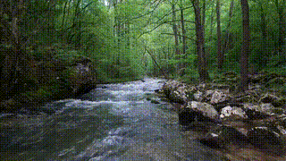
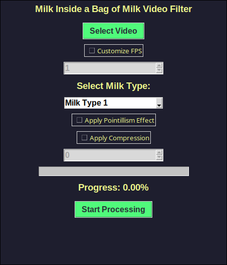

# MILK-VIDEO-CONVERTER

This repository contains a Python script that processes a local video file, applies custom filters to make it look like the game MILK INSIDE/OUTSIDE A BAG OF MILK created by Nikita Kryukov, and saves the processed video.

The original filter was created by [LucaSinUnaS](https://github.com/LucaSinUnaS) to apply it to an image. I just adapted it to process a full video. Go check his work [here](https://github.com/LucaSinUnaS/Milk-Filter).

## What the script does:

- Extracts frames from the video.
- Applies custom filters to the frames, acording to the user's input.
- Reassembles the frames into a new video with the original audio.
- Saves the new video in the same directory as the script, with the same name as the original video, but with the suffix "_filtered" added.

## CHECK THE RESULTS!!

Video before processing:

<p align="center">
  
</p>

Video after processing **(Using milk type 2, and pointillism effect)**:

<p align="center">
  
</p>


## Requirements

To run this script, you need to install the program [ffmpeg](https://ffmpeg.org/), which is used to extract the audio from the video and reassemble the frames into a new video. It is also used to compress the video.
Ffmpeg is a free and open-source project consisting of a vast software suite of libraries and programs for handling video, audio, and other multimedia files and streams. But don't worry, you don't need to know how to use it, the script will do everything for you.

Anyway, in Windows it can be a little tricky to install ffmpeg, so I recommend you to follow this [tutorial](https://www.youtube.com/watch?v=DMEP82yrs5g) to install it.

In Linux, you can simply install it using the package manager of your distribution. For example, in Ubuntu, you can use the following command:

```bash
sudo apt install ffmpeg
```

## Usage (GUI VERSION)

The GUI version can be run by executing the executable file or by running the python file.


### (Option 1) Running the executable file

On the realeases page of this repository (at the right side of the screen), you can download the executable file for Windows and Linux. Just download the file, and run the corresponding executable file.

### (Option 2) Running the python file
To run the python file, follow these steps:
Download the repository to your PC, you can do this by cloning the repository or downloading the ZIP file.
If you want to clone the repository, use the following command:

```bash
git clone https://github.com/figurophobia/Milk-Video-Converter
```
This will create a folder named "Milk-Video-Converter" in your current directory.
Place your video file in the same directory as the script (preferably in .mp4 format).

Ensure you have Python 3 installed. Install the required dependencies using the following command:

```bash
pip install -r requirements.txt
```
Run the script with the path to your video file as an argument:

```python
python videoGUI.py
```


## Iteracting with the GUI

An interface like this will appear on your screen if you run the executable/ python file correctly:

<p align="center">
  
</p>


Click on the "Select Video" button to select the video file you want to process. The video file must be in .mp4 preferably.

After selecting the video, you can customize the frame extraction FPS if you want. The default value is the FPS of the video, but you can change it to a lower value if you want to reduce the number of frames processed. (Introduce a number between 1 and the FPS of the video).

> **NOTE**: The lower the value, the lower the number of frames processed, but the lower the quality of the final video.

Select the milk type filter you want to apply to the video. You can choose between "Inside Milk" -> 1 and "Outside Milk" -> 2.

You can also apply the pointillism effect to the video. 

Finally, you can choose to compress the video. The compression level can be customized, by default it uses the same compression level as the original video, but you can change it.

The higher the value, the higher the compression, use a value between (0 the lowest compression level, 100 the highest) -> smaller file size, but lower quality video (that looks good with the milk filter).

When you are done, click on the "Process Video" button. The script will process the video and show the progress in the progress bar, when it finishes, a message will appear on the screen saying that the video was processed successfully.

## Usage (CLI VERSION) 

The CLI version can only be run by python at the moment.

### Running python file  (Only CLI option by now)
To use the script, follow these steps
Download the repository to your PC, you can do this by cloning the repository or downloading the ZIP file.
If you want to clone the repository, use the following command:

```bash
git clone https://github.com/figurophobia/Milk-Video-Converter
```
This will create a folder named "Milk-Video-Converter" in your current directory.
Place your video file in the same directory as the script (preferably in .mp4 format).

Ensure you have Python 3 installed. Install the required dependencies using the following command:

```bash
pip install -r requirements.txt
```
Run the script with the path to your video file as an argument:

```python
python videoCLI.py /path/to/your/video/file
```
Follow the on-screen prompts to customize the frame extraction FPS, the milk type filter, the pointillism effect, and the compression level. The same as the GUI version.

The script will process the video and show the progress in the console as it processes the video.


Example (you can use the testVideo.mp4 file on the repository to test the script):
```python
python videoCLI.py testVideo.mp4
```

## Things to consider
- Remember to use valid FPS and compression values, fps needs to be between 1 and the FPS of the video, and the compression value needs to be between 0 and 100.
- The script will create a temporary directory to store the frames extracted from the video. This directory will be deleted after the script finishes processing the video.
- The script will create a new video file with the same name as the original video, but with the suffix "_filtered" added. The original video will not be modified.
- The script will use the same audio as the original video. If the original video has no audio, the new video will also have no audio.
- Remember to use appropiate video files, i recommend using .mp4 files, but the script should work with other video formats.
- Be patient, the script can take a while to process the video, depending on the length of the video and the frame extraction FPS it can take a few minutes to process the video.
- In PC's with low processing power, the script can take a long time to process the video, and the interface can freeze. This is normal, just wait for the script to finish processing the video. (You can see it working in the folder where the script is located, the frames will be saved there).
- Remember to have enough space on your disk to store the frames and the new video file. The script can generate a lot of frames, depending on the frame extraction FPS and the length of the video.
- Just clarify that the script is not perfect, and the final video can have some issues, like the audio not being in sync with the video, or the video being too compressed, or the video having a lower resolution than the original video. This is because the script is not perfect and can have some bugs. If you find any bugs, please report them to me.


## Thanks

As said before, this program wouldn't be possible without the work of other people:

Thanks to [LucaSinUnaS](https://github.com/LucaSinUnaS) for creating the original filter, allowing me to adapt it to a video, and helping me.

Thanks to **Nikita Kryukov** for creating the game MILK INSIDE/OUTSIDE A BAG OF MILK, which inspired the filter.


## License

This project is licensed under the MIT License - see the LICENSE file for details.

